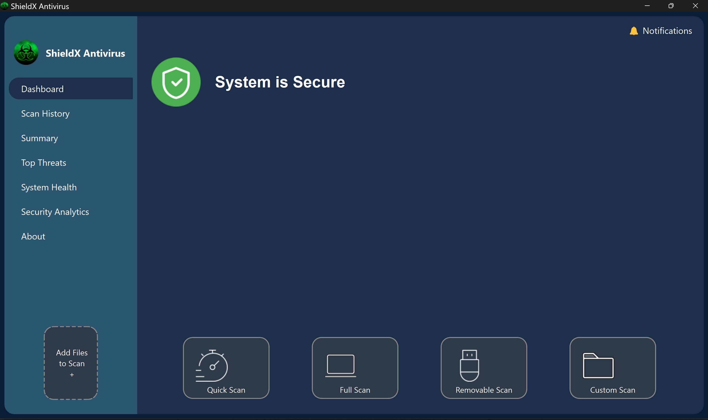
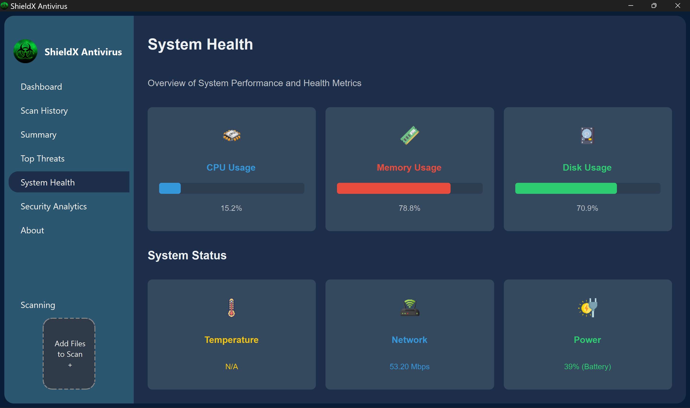
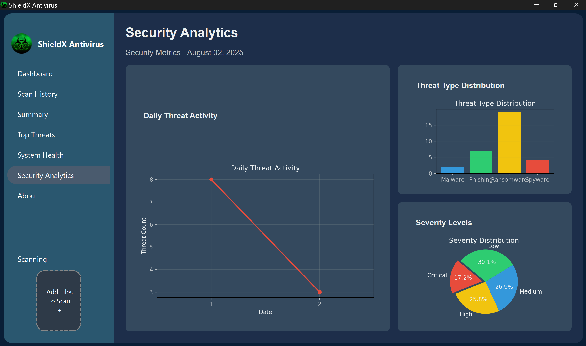

# ShieldX Antivirus 🛡️

A **high-performance AI-powered malware analysis system** that combines static analysis, dynamic analysis, and machine learning to detect and classify malicious software with **95%+ accuracy**.

---

## 🚀 Features

- 🤖 **AI-Powered Detection** - Machine learning models and embeddings
- 🔍 **Static & Dynamic Analysis** - File structure and runtime behavior
- 🧠 **Vector Database** - Semantic similarity matching
- 🖥️ **GUI Interface** - User-friendly PySide6 application
- ⚡ **Smart Caching** - Lightning-fast repeat scans
- 🎯 **Threat Intelligence** - Known malware family database
- 🔒 **Secure Sandboxing** - Safe dynamic analysis environment

---

## 🛠️ Installation

```bash
git clone https://github.com/Mhmd-Aslam/ShieldX-Antivirus.git
cd ShieldX-Antivirus
uv sync
echo "GROQ_API_KEY=your_key" > .env
python -c "from db.models import *"
```

---

## 📱 Usage

### **GUI Application**

```bash
python ui/main.py
```

### **Command Line Scanning**

```bash
# Quick scan
python main.py

# Scan specific file
python -c "from agents.agent import MalwareAgent; print(MalwareAgent('file_path').is_malware())"
```

### **API Integration**

```python
from agents.agent import MalwareAgent

agent = MalwareAgent("/path/to/suspicious/file")
is_threat = agent.is_malware()
analysis = agent.analyze_report()

print(f"Threat: {analysis['is_malware']}")
print(f"Confidence: {analysis['confidence']}%")
print(f"Family: {analysis.get('malware_family', 'Unknown')}")
```

---

## 🧰 Tech Stack

- **Python 3.13+** + **PySide6** GUI
- **LangChain** + **ChromaDB** for AI processing
- **YARA** + **PEfile** for static analysis
- **Capstone** disassembly engine
- **SQLite** + **Vector databases**

---

## 🔒 Security

- ✅ **Sandboxed execution** environment
- ✅ **No malware persistence** on system
- ✅ **Encrypted API communications**
- ✅ **Memory-safe operations**
- ✅ **Offline analysis** capability

---

## 📊 Performance

- ⚡ **2-5 seconds** per file analysis
- 🎯 **95%+ accuracy** on known threats
- 📉 **<2% false positives** on clean files
- 💾 **200-500MB** memory usage
- 🚀 **<1 second** cached results

---

## 🏗️ Architecture

```
ShieldX-Antivirus/
├── agents/     # AI analysis engine
├── db/         # Database models
├── scanner/    # File scanning utilities
├── static/     # Static analysis tools
├── dynamic/    # Runtime behavior analysis
├── ui/         # PySide6 GUI
└── tests/      # Test suite
```

---

## 📷 Screenshots

<p align="left">
  
  
  
  
  
</p>

---

## 🧪 Testing

```bash
python -m pytest tests/
```

---

## 🤝 Contributing

1. Fork the repository
2. Create feature branch
3. Make changes
4. Submit pull request

---

## 📄 License

MIT License

---

**⚠️ Disclaimer**: Educational and research use only. Always scan in isolated environments.